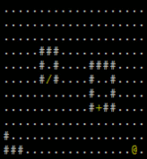

# What is this?
A simple roguelike written in C++. Renders using the ncurses library.

## Gameplay Examples
|  |
|---|
|*Basic movement in all 8 directions*|

|  |   |
|---|---|
| *Opening and Closing Doors* | *Picking up and Dropping Items* |

# To compile and run the application:
1. `git clone https://github.com/Captain-Chen/rltutorial.git`
2. Install NCurses and ensure the library is properly linked to your compiler of choice.

On Windows, ensure the following environment variables are set. I am using the [MinGW-w64](https://github.com/niXman/mingw-builds-binaries/releases) compiler:
| Variable | Example Value(s) |
| --- | --- |
| C_INCLUDE_PATH | c:\mingw64\include;C:\mingw64\include\ncursesw |
| CPLUS_INCLUDE_PATH | %C_INCLUDE_PATH% |
| LIBRARY_PATH | c:\mingw64\lib |

3. Change into the directory and compile the application
    - On Linux: `g++ *.cpp -lcurses -o rltutorial` and run `./rltutorial`
    - On Windows: `g++ *.cpp -lncursesw -o rltutorial` and run `rltutorial.exe`

# Requirements
* [Ncurses](https://invisible-island.net/ncurses/#download_ncurses)
    - For Windows, there is a [NCurses port](https://invisible-island.net/ncurses/#download_mingw) for MinGW
* A C++ compiler (e.g. [MinGW](https://github.com/niXman/mingw-builds-binaries/releases))